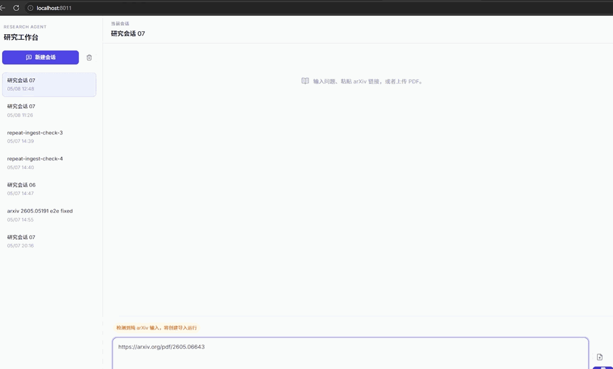
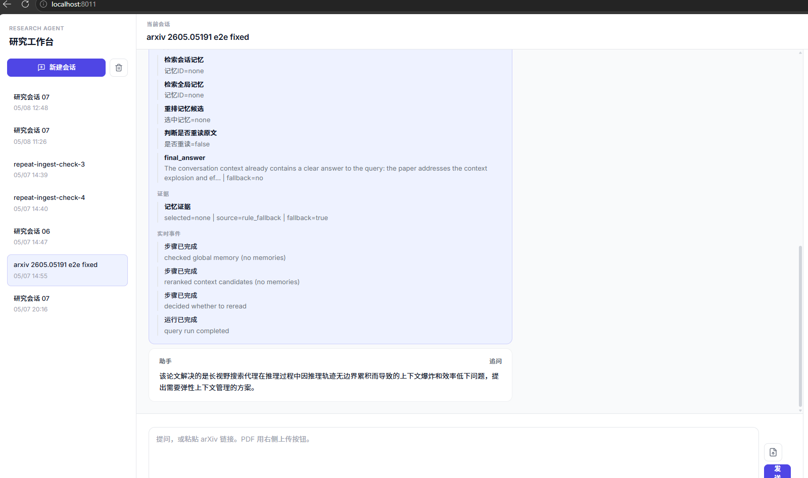
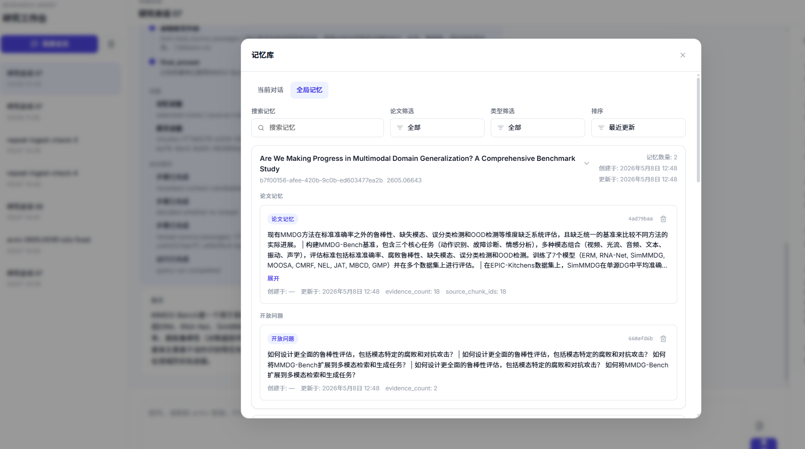
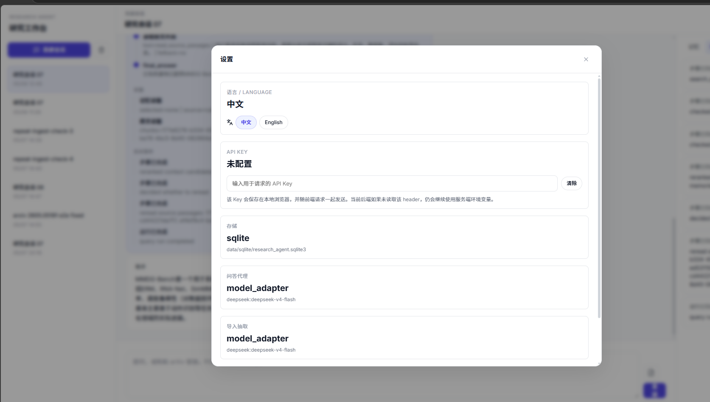

# Memory-Routed Paper Agent

> 一个面向论文研究场景的 Agent：导入论文后先写入长期记忆，后续问答优先使用记忆，再决定是否回读原文。

<p align="center">
  
</p>

## 这是什么

这个项目不是一个“把 PDF 扔进去然后直接问答”的普通论文聊天工具。

它的重点是把论文理解结果沉淀成结构化研究记忆，并且让后续问答过程清楚地体现：

- 先查当前 session 相关记忆
- 再查可复用的全局记忆
- 只有记忆不够时才回读原文 chunk

因此，系统价值不只是“能回答”，而是“能看见记忆如何改变后续决策”。

## 为什么它不是普通 RAG

| 对比项 | 标准 RAG | 本项目 |
|---|---|---|
| 问答路径 | 基本固定：query -> retrieve -> generate | 由模型决定是否需要检索、是否需要回读原文 |
| 论文导入 | 常见做法是直接切 chunk 后检索 | 先导入，再提取并持久化结构化研究记忆 |
| 长期记忆 | 通常较弱或不存在 | 明确支持 `paper_memory`、`relation_memory`、`open_question_memory` |
| 可观测性 | 多数只展示最终回答 | 前端展示工具调用、思考过程、trace、timeline、memory snapshot |

<p align="center">
  
</p>

## 当前重点能力

- **论文导入**
  - 支持直接粘贴 arXiv 链接
  - 支持上传本地 PDF
  - 导入后会下载 / 解析 PDF、切 chunk、注册 paper、写入记忆、生成摘要

- **长期记忆优先的问答**
  - 后续问题先查 session memory
  - 再查 global memory
  - 记忆不足时才回读原文

- **模型驱动工具调用**
  - 模型可以自己决定下一步是检索记忆、搜索 arXiv、导入论文、回读原文还是直接回答
  - 宿主 runtime 仍然控制生命周期、step limit、trace 和 finish/fail 语义

- **实时可视化**
  - 前端可以看到 step-by-step 的工具调用
  - 可以查看 timeline、memory drawer、trace reasoning
  - 能看到“为什么这一步用了记忆 / 为什么这一步回读了原文”

<p align="center">
  
</p>

## 这次新增的能力

这次更新把“搜索论文 -> 导入论文 -> 基于记忆继续问答”的链路补完整了，同时加入了可直接展示的部署入口。

- **新增 `import_arxiv_paper`**
  - 这是一个模型可调用的 arXiv 导入工具
  - 它复用现有 arXiv ingest run 链路，不另外创建一套 PDF URL 导入逻辑
  - 支持传入 arXiv id、abs URL、pdf URL，并统一规范化到标准 abs URL

- **新增 `search_arxiv`**
  - 通过官方 arXiv API 搜索论文
  - 只返回轻量元数据：`arxiv_id`、标题、作者、摘要、分类、abs URL、pdf URL
  - 不下载 PDF，不触发 ingest
  - 模型可以先搜索，再显式调用 `import_arxiv_paper`

- **新增 arXiv 失败兜底**
  - 如果搜索不到、网络失败、下载失败，query runtime 会返回结构化 `no_results`
  - 不会因为单次 arXiv 搜索/导入失败就把整轮问答直接打崩

- **新增静态 Demo 展示**
  - 提供 GitHub Pages 可用的静态演示页
  - 使用真实前端 + mock `/api` 数据
  - 自动播放多轮消息，展示搜索 arXiv、导入论文、长期记忆影响回答、与 RAG 对比等关键能力

- **新增 Docker 一键部署**
  - 增加 `Dockerfile` 和 `docker-compose.yml`
  - 可以直接构建并运行真实前后端

## Demo 与部署

- 静态演示页：
  - `https://zoean-z.github.io/ResearchAgent/`

- Docker 一键启动：

```bash
docker compose up --build
```

- 启动后访问：
  - `http://127.0.0.1:8011/`

说明：

- GitHub Pages 上的是只读静态演示，使用真实前端和预制会话数据
- Docker 启动的是可交互的真实应用
- 如需真实模型调用，请在启动前配置 `DEEPSEEK_API_KEY`

## 快速开始

### 方式一：Docker

```bash
docker compose up --build
```

这是最适合演示和本地快速试跑的方式。

### 方式二：本地开发

后端：

```bash
cd backend
pip install -e .
```

前端：

```bash
cd frontend
npm install
npm run build
```

然后启动后端：

```bash
uvicorn research_agent.api.app:app --host 0.0.0.0 --port 8011
```

或者在 Windows 下直接使用脚本：

```powershell
.\scripts\start-dev.ps1
```

## 运行时技术路径

当前系统的主要调用链大致是：

1. 用户输入问题 / arXiv 链接 / 上传 PDF
2. 前端或 query runtime 决定是普通问答还是论文导入
3. 导入路径会解析 PDF、注册论文、写入 chunk 和结构化记忆
4. 后续问答先使用 session / global memory
5. 只有记忆不足时才回读 source passages
6. 结果通过 trace、timeline 和 memory drawer 在前端展示

## 项目结构

```text
backend/    FastAPI API、runtime、services、tools、storage adapters
frontend/   React + TypeScript 工作台前端
data/       本地 artifacts、SQLite 数据
docs/       项目说明、接口文档、演示素材
scripts/    启动与辅助脚本
```

## 技术栈

- Backend: Python / FastAPI / SQLite / Pydantic
- Frontend: React / TypeScript / Vite
- LLM: DeepSeek API
- Memory Layer: OpenViking（可选）+ 本地 SQLite runtime/display store

<p align="center">
  
</p>

## 适合展示的点

如果这是一个求职或项目展示仓库，最值得看的不是“它能不能回答论文问题”，而是下面这几件事：

- 它把论文导入、长期记忆、追问和可视化 trace 串成了一条完整链路
- 它不是固定 RAG，而是模型驱动的工具调用和决策
- 它能展示“长期记忆如何影响下一轮回答”
- 它既有静态 demo，也有 Docker 一键部署入口

## 后续可继续扩展的方向

- 更完整的 token 级流式输出
- 更强的 ingest 质量控制与评估
- 更丰富的 memory editing / inspection 工具
- 在不改变核心 runtime 语义的前提下，继续扩展工具面
